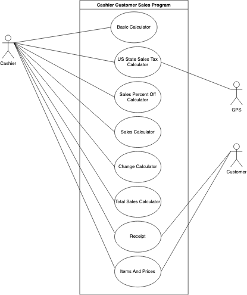

# Cashier Customer Sales Program
Cashier Customer Sales Program

## Project Abstraction
At least one paragraph description of the overall project. Include a UML use case diagram or other helpful diagram.

This program can be used by people who do a lot of shopping throughout their lives. This program allows people to select items that are either on sale or not on sale and they will make sure that all calculations are done correctly based on the receipt that they received after they finished checking out. The people will verify that the percent off sales items have been applied and the included items and their prices are also correct before finshing their checkout process. This test will be used when calculating the sales tax in all of 50 US States alternatively more effective and more efficient. Also, the mock testing will be used to calculate sales at different percentages being taken off of its own set of items alternatively more effective and more efficient. I will be using the mockito package for this program. This test allows me to verify that the code being tested works, regardless of its dependencies. The theory is that if the code that I write works as designed and my dependencies work as designed, then they should work together as designed. It is used to mock interfaces so that a dummy functionality can be added to a mock interface that can be used in unit testing. 

## Project Relevance
A one paragraph explanation of how the proposal is linked to the educational goals of this class and why this goal is important goal.

Goal - Mockito Testing In Java: 

What is Mock Testing in theory? Why is it important in Software Design? Include the paystation as an example

Mocking is primarily used in unit testing. An object under test may have dependencies on other (complex) objects. To isolate the behavior of the object you want to replace the other objects by mocks that simulate the behavior of the real objects. This is useful if the real objects are impractical to incorporate into the unit test. Mock objects help isolate the component being tested from the components it depends on and applying mock objects effectively is an important part of test-driven development (TDD). A mock object can be useful in place of a real object that runs slowly or inefficiently in practical situations. For example, in the PayStation Lab assignment, the mock testing would have been extremely useful, more effective, and more efficient for calculating the parking rates alternatively. 

## Conceptual Design
A one-paragraph description of your proposed contribution.

I will be doing this project all by myself for the last 4 - 5 weeks of the semster. I will begin with implementing all of the calculator classes for this project. Then, I will implelemt the receipt class for this project. And then I will implement the customer and cashier classes for this project. Then, I will create the ItemsAndPrices class. At the end, I will be unit testing using Mockito Testing and I made a MainForUnitTest class(I will be using mockito testing for calculating each of the state's sales tax alternatively more effective and more efficient) for it. And also create the user interface using the Main class that I have created for this project. 

This project consists of the following interfaces: Cashier, BasicCalculator, SalesTaxCalculator(mockito testing will be used heavily here), SalesPercentOffCalculator(mock testing will be used heavily here), Customer, SalesCalculator(subtotal), ChangeCalculator, TotalSalesCalculator, and Receipt. This project also consists of the following classes: CashierImpl, BasicCalculatorImpl, SalesTaxCalculatorImpl, SaleSalesCalculatorImpl(subtotal), ChangeCalculatorImpl, ItemsAndPRices, ReceiptImpl, TotalSalesCalculatorImpl(mockito testing will be used haeavily here), Main, and MainForUnitTest. The cashier has access to the following parts of its system: Basic Calculator, Sales Tax Calculator, Sales Percent Off Calculator(mock testing will be used heavily here), Sales Calculator(subtotal), Change Calculator, Total Sales Calculator, Receipt, and Items And Prices. The customer has access to Receipt and Items And Prices.

## Background
A URL reference to the project. Add text on how to build and run succesfully.

<https://github.com/parsatempleowl-parsatempleuniversity/CashierCustomerSalesProgram.git>

**Building**
- Step 1: Download and install IntelliJ IDEA Community (Download Link: <https://www.jetbrains.com/idea/download/#section=mac>)
- Step 2: Download and install Java JDK (Download Link: <https://www.oracle.com/technetwork/java/javase/downloads/jdk13-downloads-5672538.html>)
- Step 3: Download the following files: junit4.11.jar (Download Link: <https://mvnrepository.com/artifact/junit/junit/4.11>), hamcrest-core-1.2.1.jar (Download Link: <https://mvnrepository.com/artifact/org.hamcrest/hamcrest-core/1.2.1>), and mockito-all-2.0.2-beta.jar (Download Link: <https://mvnrepository.com/artifact/org.mockito/mockito-all/2.0.2-beta>)
- Step 4: Clone into this repository
- Step 5: Open IntelliJ IDEA and create a new project and call it MockTest1 and click Finish (accept defaults for the first two steps)
  - Will change the name of the project to CashierCustomerSalesProgram after I started working on it for a bit of time
  - Step 1: Click on File
  - Step 2: Click on Project Structure
  - Step 3: Click on Modules
  - Step 4: Click on the + sign to add the downloaded jar files one by one
  - Step 5: Click on Apply
  - Step 6: Select 13.0.2 (java version "13.0.2") as your Module SDK
  - Step 6: Click on Apply again
  - Step 7: Click on Finish
- Step 6: Drag and Drop the Project Files From The Repo Folder on your PC into the src folder of the newly created project in IntelliJ IDEA
- Step 7: Click on Build
- Step 8: Click on Build Project

**Running** 
- Step 1: Click on the arrow to the left of src folder
- Step 2: Right-Click on PortfolioTester file
- Step 3: Click on Run 'PortfolioTester.main()'
